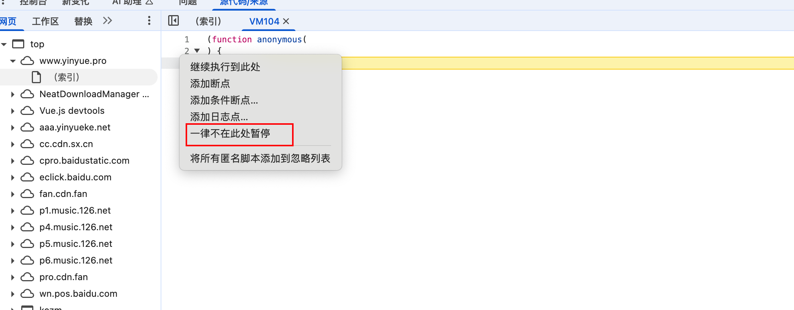
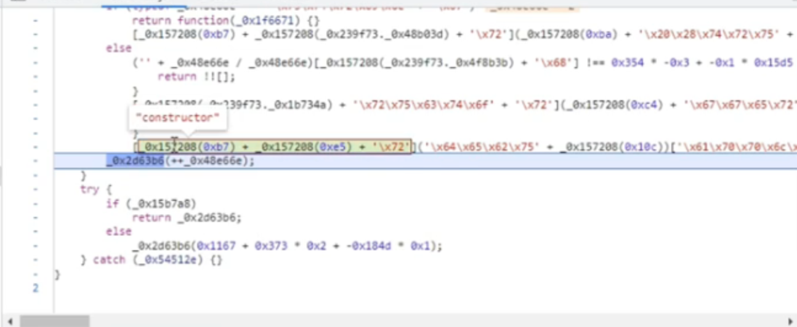
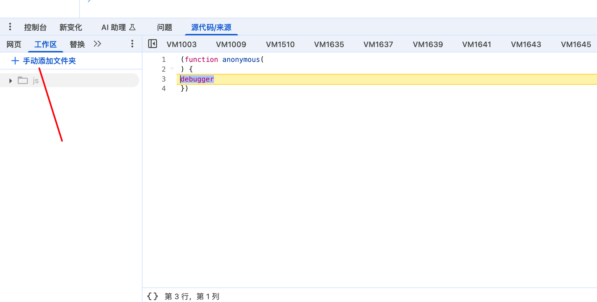

# hook脚本

### 网页hook

#### hook方法

##### JSON.stringify

应用场景: 当请求参数是密文

```js
(function () {
    var stringify_ = JSON.stringify;
    JSON.stringify = function (arg) {
        console.log("断住了", arg);
        debugger;
        return stringify_(arg);
    }
}());
```

##### JSON.parse

用来将JSON字符串转换为JS对象, 响应参数如果是密文则会用把后端返回的密文字符串转换为JS对象

```js
(function () {
    var parse_ = JSON.parse;
    JSON.parse = function (arg) {
        console.log("断住了", arg);
        debugger;
        return parse_(arg);
    }
}());
```


##### 拦截器

有些情况是会使用拦截器来解析响应, 所以可以直接搜索关键字: interceptors.response.use


##### XHR

用来断请求后端接口

```js
(function(){
    var open = window.XMLHttpRequest.prototype.open;
    window.XMLHttpRequest.prototype.open = function(method, url, async) {
        if (url.indexOf("Signature") != -1) {
            debugger;
        }
        return open.apply(this, arguments);
    }
}());
```


##### XMLHttpRequest (header参数)

```js
(function() {
    var sh = window.XMLHttpRequest.prototype.setRequestHeader;
    window.XMLHttpRequest.prototype.setRequestHeader = function(key, value){
        if (key == 'token' || key == 'Token') {
            debugger;
        }
        return sh.apply(this, arguments);
    }
})();
```


##### cookie

```js
(function () {
    var cookie_temp = '';
    Object.defineProperty(document, 'cookie', {
        set: function(val){
            if (val.indexOf('v') != -1) {
                debugger;
            }
            console.log("Hook捕捉到cookie设置->", val);
            cookie_temp = val;
            return val;
        },
        get: function(){
            return cookie_temp;
        },
    })
})();
```

其中v修改为你要断点的cookie包含的关键字


##### header

```js
var code = function(){
    var org = window.XMLHttpRequest.prototype.setRequestHeader;
    window.XMLHttpRequest.prototype.setRequestHeader = function(key, value) {
        if (key.toLowerCase() == 'x-itouchtv-ca-signature') {
            debugger;
        }
        return org.apply(this, arguments);
    }
}
var script = document.createElement('script');
script.textContent = '(' + code + ')()';
(document.head||document.documentElement).appendChild(script);
script.parentNode.removeChild(script);
```


#### hook过debugger

debugger 是最常见的反调试, 除了debugger之外, 还有其他反调试手段

1. 禁用快捷键, 不让打开控制台
2. 检测打开devtools就跳转
3. 检测打开devtools就关闭网页
4. 窗口大小差异检测
5. 特殊属性检测 一般通过setInterval检测


##### 右键大法

在需要断住的位置 然后右键 选择一律不在此处暂停



注意: 如果这个网站加了一些逻辑, 比如只要你设置了一律不在此处暂停, 网页就会卡死. 实际上循环执行了一些逻辑, 无限创建一些费代码执行, 把内存占满, 也可以称为内存爆破.


##### 方法置空

当我们跟栈分析debugger的时候, 发现他是构造器生成的debugger, 就可以把构造器置空, 让他失去效果

> 构造器



```js
// 方法一
var _constructor = constructor;
Function.prototype.constructor = function (s) {
    if (s === "debugger") {
        return null;
    }
    return _constructor(s);
}

// 方法二
Function.prototype.__constructor_back = Function.prototype.constructor;
Function.prototype.constructor = function () {
    if (arguments && typeof arguments[0] === 'string') {
        if ("debugger" === arguments[0]) {
            return;
        }
    }
    return Function.prototype.__constructor_back.apply(this, arguments);
}
```


> 定时器

当跟栈分析出来 他是使用定时器进行的无限循环debugger的时候, 只需要给定时器空让他失去原来的循环效果

方法一:

```js
setInterval = function () {};
```

方法二:

```js
setinval_1 = setInterval
setInterval = function (a, b) {
    if (a.toString().indexOf('debugger') == -1) {
        console.log(a);
        return setinval_1(a, b);
    }
}
for (var i = 1; i < 99999; i++) window.clearInterval(i);
```


##### 替换大法

通过操作网页devtools中的替换功能



##### 函数Funcation启动debugger

```js
(() => {
    Function.prototype.__constructor = Function;
    Function = function () {
        if (arguments && typeof arguments[0] === 'string') {
            if ("debugger" === arguments[0]) {
                return;
            }
            return Function.apply(this, arguments);
        }
    }
})();
```


##### eval 启动debugger

当你发现有一段代码一直在执行, 向前跟栈是eval加载这段代码的时候就可以用如下的代码:

```js
var eval_a = eval
eval = function(a) {
    if (a === '(function() {var a = new Date(); debugger; return new Date() - a > 100;}())') {
        return null;
    }
    else {
        return eval_a(a)
    }
}
```

