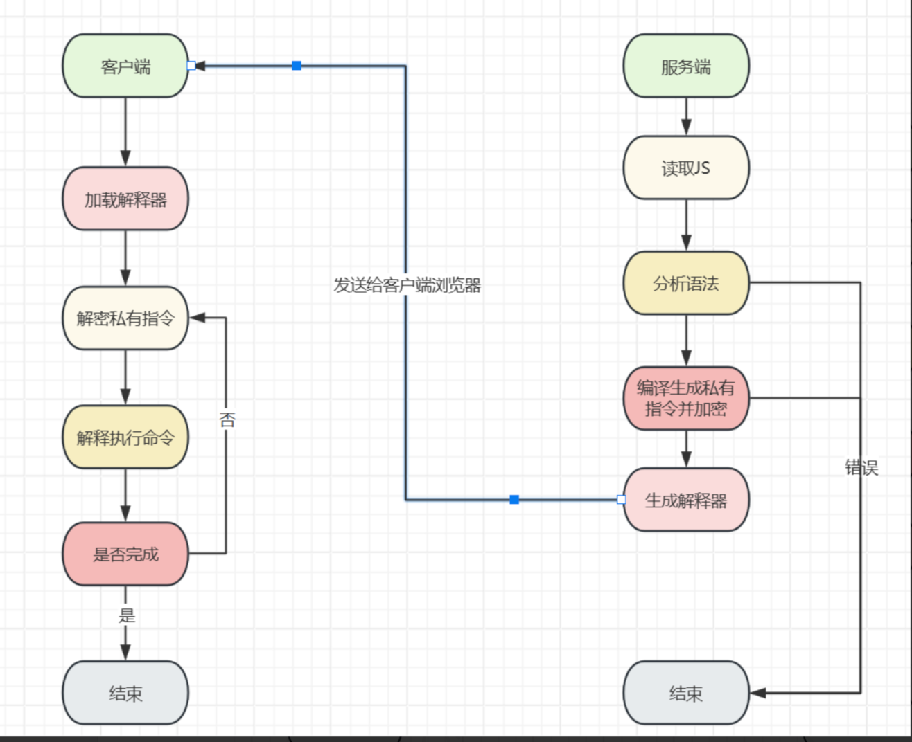

# jsvmp

简单来说，**JSVMP (JavaScript Virtual Machine Protection)** 是 JS 逆向中最令人头秃的反爬技术之一。

如果说普通的 JS 混淆（如变量名替换、十六进制字符串）是把一张满分作文揉皱了给你看，那么 JSVMP 就是**把这篇作文撕碎，编成密码本，然后给你一个专门用来翻译这个密码本的机器**。




以下我将从逆向的角度，由浅入深地拆解 JSVMP。

------

### 1. 核心原理：套娃游戏

在正常的 JS 执行流程中，浏览器直接读取代码并执行。 而在 JSVMP 中，开发者自己用 JS 写了一个**虚拟 CPU（解释器）**。

- **原始代码：** `var a = 1 + 2;`
- **编译后（你在浏览器里看到的）：**
  1. **指令集（Opcode）：** 一串看不懂的乱码或数字数组（比如 `[0x10, 0x01, 0x02, 0x20...]`）。
  2. **解释器（VM）：** 一个巨大的函数，负责读取上面的数组，一步步执行动作。

### 2. 怎么一眼识别 JSVMP？

当你打开 F12 调试代码时，如果看到以下特征，基本就是 JSVMP 了：

1. **巨大的 `while` 循环：** 代码外层包裹着一个死循环。
2. **巨长的 `switch-case`：** 循环内部是一个巨型 `switch` 语句，用来判断当前要执行什么“指令”。
3. **看不懂的字符串/数组：** 既然是虚拟机，就必须有“字节码”（Bytecode），通常表现为一个很长的加密字符串或数组。

**代码骨架示例：**

```js
// 这是你的噩梦开始的地方
(function (bytecode) {
    var pc = 0; // 指令指针 (Program Counter)
    var stack = []; // 虚拟栈
    
    while (true) {
        var opcode = bytecode[pc++]; // 读取下一个指令
        
        switch (opcode) {
            case 0x01: // 比如这是“加法”指令
                var a = stack.pop();
                var b = stack.pop();
                stack.push(a + b);
                break;
            case 0x02: // 比如这是“赋值”指令
                 // ... 逻辑 ...
                break;
            case 0x99: // 结束指令
                return stack.pop();
        }
    }
})([0x10, 0x55, 0x...]); // 传入的一大坨字节码
```


