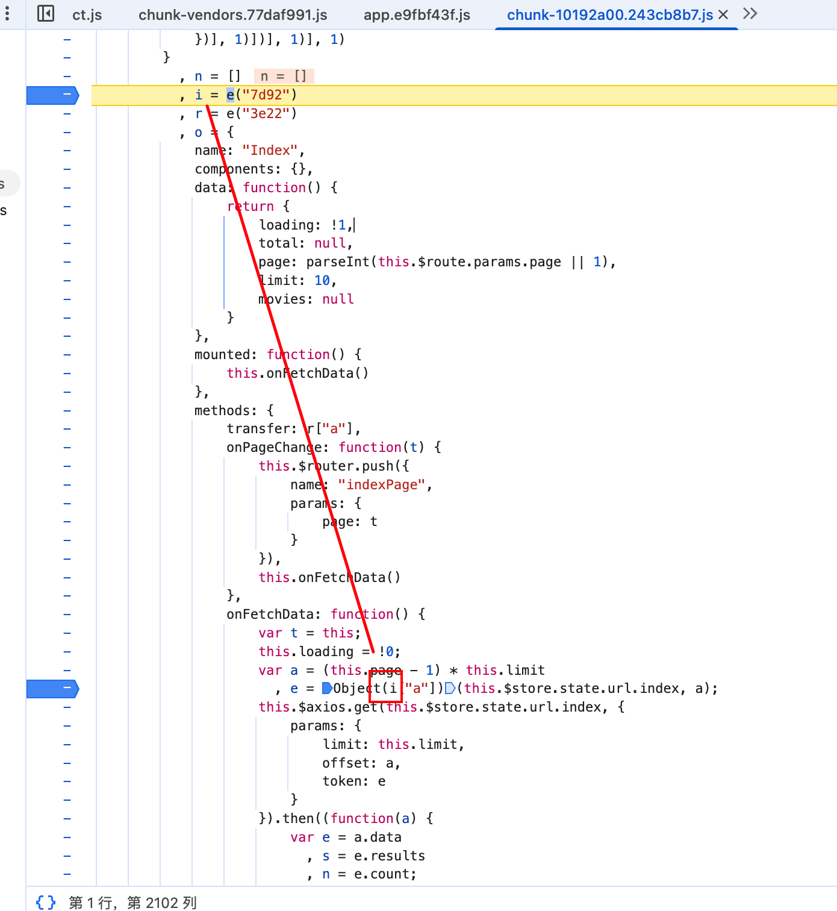
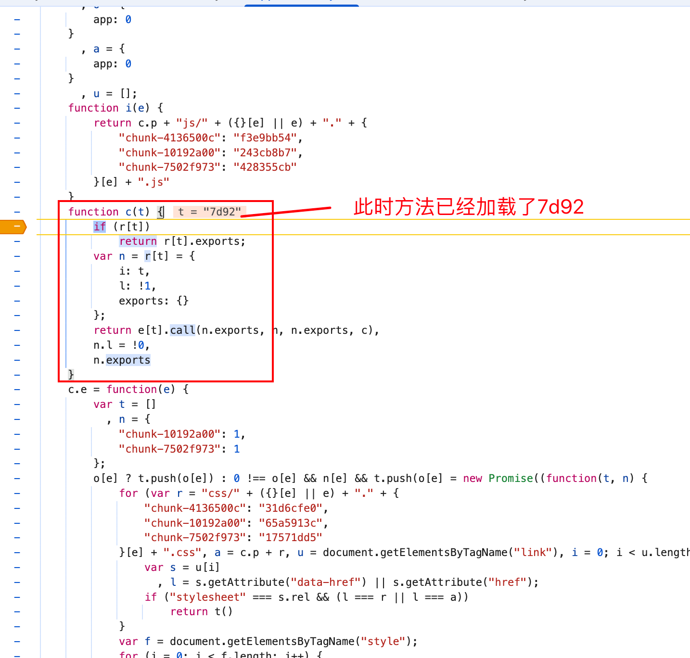
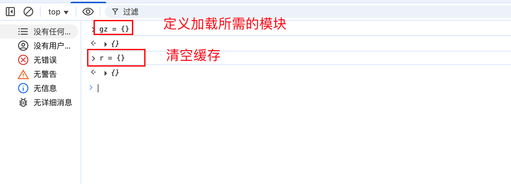
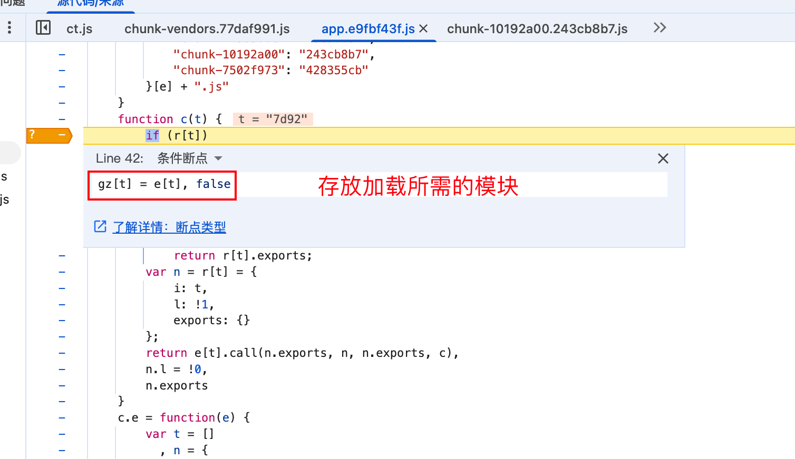
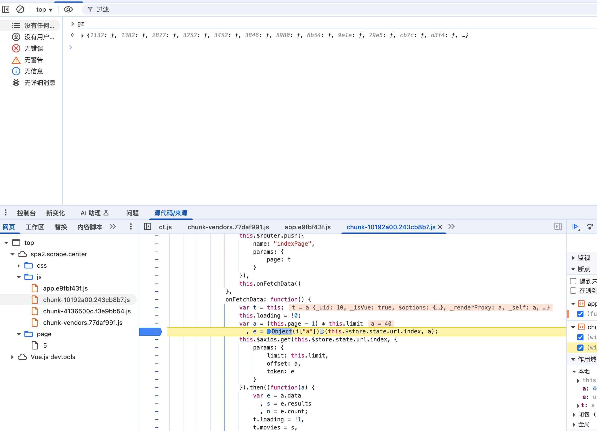

# webpack

是js应用程序的模块打包器, 可以把开发中的资源数据模块化, 用过loader加载器和plugins插件对资源进行处理, 打包为符合正常的前端资源, 所有资源都是js渲染出来的.

webpack是一个基于模块化打包构建的工具.

它的基本骨架如下：

```js
// 形式一：数组形式 (常见于单入口简单包)
!(function(modules) { /* 加载器逻辑 */ })([模块1, 模块2, ...])

// 形式二：对象形式 (常见于多入口或大型包，Key 为模块路径或 Hash)
!(function(modules) { /* 加载器逻辑 */ })({ "key1": 模块1, "key2": 模块2 })
```

* `!` (或 `(` )：用于将函数声明转换为表达式，使其能立即执行。
* `modules` (形参)：存放所有业务代码的“仓库”（数组或对象）。


> 数组形式

**特征**：模块 ID 为数字索引 (0, 1, 2...)。

**入口**：通常默认加载第 0 个模块 `n(0)`。

```js
!function (e) { // e 是传入的模块数组 [f1, f2]
    //Cache: 缓存对象，防止模块被重复执行
    var t = {}; 

    // Loader: 核心加载函数 (即 require)
    function n(r) {
        // 1. 查缓存：如果模块已加载，直接返回导出对象
        if (t[r]) return t[r].exports;

        // 2. 初始化：构建新模块对象并存入缓存
        var o = t[r] = {
            i: r,        // ID
            l: !1,       // Loaded (是否已加载)
            exports: {}  // 也就是 module.exports，初始为空
        };

        // 3. 🔴 执行模块：这是最关键的一步！
        // e[r] 取出模块函数，.call 改变 this 指向
        // 参数说明: (this指向exports, module对象, module.exports, require函数)
        e[r].call(o.exports, o, o.exports, n);

        // 4. 标记加载完成
        o.l = !0;

        // 5. 返回导出的内容
        return o.exports;
    }

    // 启动：加载入口模块 (数组通常从 0 开始)
    return n(0); 

}([ 
    // 模块 0 (入口)
    function (module, exports, require) {
        console.log('Main module start');
        require(1); // 加载模块 1
    }, 
    // 模块 1
    function (module, exports, require) {
        console.log('Module 1 loaded');
    }
])
```


> 对象形式

**特征**：模块 ID 为字符串（路径或 Hash）。

**入口**：需要指定具体的 ID，如 `n("1001")` 或 `n("s8fv")`。


```js
!function (e) { // e 是传入的模块对象Map
    var t = {}; 

    function n(r) {
        if (t[r]) return t[r].exports;
        
        var o = t[r] = {
            i: r,
            l: !1,
            exports: {}
        };
        
        console.log('loading module: ', r);
        
        // 执行模块代码
        e[r].call(o.exports, o, o.exports, n);
        
        o.l = !0;
        return o.exports;
    }

    // 启动：需要指定具体的入口 ID (逆向时需观察这里调用了谁)
    return n('1001');

}({
    "1001": function (module, exports, n) {
        console.log("1001 calling .....");
        n("1002"); // 引用依赖
    },
    "1002": function (module, exports, n) {
        console.log("1002 calling .....");
    }
})
```


> module.exports

1. 为啥需要:

在 Webpack 打包的代码里，每一个模块（Module）都被包裹在一个函数里：

```js
window = global
!function (e) {
    var t = {};

    // Loader: 核心加载函数 (即 require)
    function n(r) {
        // 1. 查缓存：如果模块已加载，直接返回导出对象
        if (t[r]) return t[r].exports;

        // 2. 初始化：构建新模块对象并存入缓存
        var o = t[r] = {
            i: r,        // ID
            l: !1,       // Loaded (是否已加载)
            exports: {}  // 也就是 module.exports，初始为空
        };
        console.log("calling: ", r)
        e[r].call(o.exports, o, o.exports, n);

        // 4. 标记加载完成
        o.l = !0;

        // 5. 返回导出的内容
        return o.exports;
    }

    window.loader = n


    // 启动：加载入口模块 (数组通常从 0 开始)
    return n(0);

}([
    // 模块 0 (入口)
    function (module, exports, require) {
        console.log('Main module start');
    },
    function (module, exports, require) {
        var a = 1;

        function encrypt(str) {
            return str + a;
        }

        module.exports = {
            myEncrypt: encrypt  // 把私有的 encrypt 函数，以 myEncrypt 的名字暴露出去
        };
    }
])
```

此时我们想要执行encrypt方法:

```js
modules = window.loader(1)	//就是module.exports
console.log(modules.myEncrypt('hello'))
```


2. 常见赋值方式:

* 直接赋值（最常见）

```js
module.exports = function(e) { return e + 1 };
// 逆向调用：var func = require(ID); func(1);
```

* **使用 exports 别名（为了省事）** Webpack 为了方便，把 `exports` 变量指向了 `module.exports`。

```js
// 这里的 exports 就是 module.exports
exports.encrypt = function() {};
exports.decrypt = function() {};
// 逆向调用：var utils = require(ID); utils.encrypt(1);
```


在 JS 逆向的“扣代码”过程中，**你的最终目标就是找到那个包含了核心加密算法的 `module.exports`**，然后把它整个劫持下来，供你的 Python 爬虫调用。


> 总结

1. **加载器是核心 (`n`)**：

- 逆向时，所有模块的加载都通过这个函数。
- 在 Chrome 调试时，只要在这个函数内部打断点，就能看到所有模块的加载顺序和 ID。

2. **`call` 是传送门**：

- 代码 `e[r].call(o.exports, ...)` 是从 Webpack 调度层跳转到具体业务逻辑层的时刻。
- 步入 (Step Into) 这一行，你就能进入加密函数的内部。

3. **exports 是战利品**：

- 无论模块内部逻辑多复杂，最终对外暴露的只有 `module.exports`。
- 我们“扣代码”或“偷家”，偷的就是这个 `exports` 对象。


> 解题思路

1. 首先先定位加载器函数: 可以往最上翻、也可以定位到赋值然后进入
2. 扣加载器相关代码:
   1. 做好功能调用前的日志打印
   2. 去除加载器内的初始化操作, 比如一些检测是否是web环境等, 这样可以少补环境
   3. 赋一个全局可以使用的加载器对象, 可以在外部调用
3. 引入加载器相关的js, 然后模仿加密的位置一样去调用相关的函数


#### 扣webpack模块

1. hook注入扣

以https://spa2.scrape.center/page/ 这个网站为例子

* 先找到加密的位置:



* 进入方法找到加载器



* 注入断点来获取加载7d92所需要的模块






* 执行断点到加密的方法(加载完该模块)



这个时候gz就存放了所需的模块了

* 导出所需模块代码:

  ```js
  Object.entries(gz).map(([key, value]) => `"${key}" : ${value}`).join(", ");
  ```


#### webpack模块自吐

只需要替换网站的js即可:

```js
window.code = '';
r = function (e) {
    if (r[e])
        return r[e].exports;
    var d = r[e] = {
        i: e,
        l: !1,
        exports: {}
    };
    console.log(e)
    window.code += e + ':' + o[e] + ',\r\n'
    return o[e].call(d.exports, d, d.exports, r),
        d.l = !0,
        d.exports
}
```


