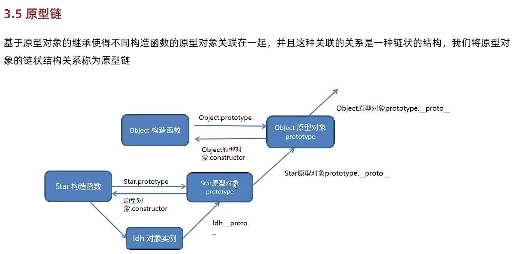

# 补环境

## 吐环境脚本


### 不检测原型链

```js
function SetProxy(proxyObjs) {
    for (let i = 0; i < proxyObjs.length; i++) {
        const handler = `{
      get: function(target, property, receiver) {
        console.log("方法:", "get  ", "对象:", "${proxyObjs[i]}", "  属性:", property, "  属性类型：", typeof property, ", 属性值：", target[property], ", 属性值类型：", typeof target[property]);
        return target[property];
      },
      set: function(target, property, value, receiver) {
        console.log("方法:", "set  ", "对象:", "${proxyObjs[i]}", "  属性:", property, "  属性类型：", typeof property, ", 属性值：", value, ", 属性值类型：", typeof target[property]);
        return Reflect.set(...arguments);
      }
    }`;
        eval(`try {
            ${proxyObjs[i]};
            ${proxyObjs[i]} = new Proxy(${proxyObjs[i]}, ${handler});
        } catch (e) {
            ${proxyObjs[i]} = {};
            ${proxyObjs[i]} = new Proxy(${proxyObjs[i]}, ${handler});
        }`);
    }
}

proxyObjs = ['window', 'document', 'location', 'navigator', 'history','screen']
SetProxy(proxyObjs)
```


### 检测原型链

```js
/**
 * 🎨 日志格式化配置
 */
const LOG_CONFIG = {
    colors: {
        reset: "\x1b[0m",
        dim: "\x1b[2m",
        red: "\x1b[31m",
        green: "\x1b[32m",
        yellow: "\x1b[33m",
        blue: "\x1b[34m",
        magenta: "\x1b[35m",
        cyan: "\x1b[36m",
    },
    maxValueLen: 50,
    colWidth: {
        type: 12,
        obj: 20,
        prop: 30
    }
};

/**
 * 日志格式化
 */
function formatValue(value) {
    const { colors } = LOG_CONFIG;
    if (value === undefined) return `${colors.red}undefined${colors.reset}`;
    if (value === null) return `${colors.red}null${colors.reset}`;
    if (typeof value === 'function') {
        return `${colors.cyan}[Function: ${value.name || 'anonymous'}]${colors.reset}`;
    }
    let str = String(value);
    if (str.length > LOG_CONFIG.maxValueLen) str = str.substring(0, LOG_CONFIG.maxValueLen) + '...';
    if (typeof value === 'string') return `"${str}"`;
    return str;
}

/**
 * hook脚本
 */
function watch(obj, name, visited = new WeakSet()) {
    const { colors, colWidth } = LOG_CONFIG;

    if (obj === null || typeof obj !== 'object' || visited.has(obj)) {
        return obj;
    }
    visited.add(obj);

    // ⬇️ 核心打印函数
    const log = (color, type, prop, extra = "") => {
        const typeStr = `${color}${type}${colors.reset}`.padEnd(colWidth.type + 10, ' ');
        const objStr = `对象: ${name}`.padEnd(colWidth.obj, ' ');
        const propStr = `属性: ${String(prop)}`.padEnd(colWidth.prop, ' ');
        console.log(`${typeStr}${objStr}${propStr} ${colors.dim}|${colors.reset} ${extra}`);
    };

    // 检查原型链访问
    const checkPrototypeChain = (target, property) => {
        let current = target;
        while (current) {
            // 如果属性直接在当前层找到，说明不是原型链查找（至少不是向上查找）
            if (Object.prototype.hasOwnProperty.call(current, property)) {
                return false;
            }
            // 向上爬一层
            current = Object.getPrototypeOf(current);

            // 如果爬到了非 Object.prototype 的原型，说明触发了原型链检测
            if (current && current !== Object.prototype && current !== null) {
                // 🌟 修改：去掉了具体的来源打印，只提示发现了原型链属性
                console.log(`${colors.red}[PROTO_CHK]`.padEnd(colWidth.type, ' ') + `🚨 发现原型链属性! (对象: ${name}, 属性: ${String(property)})${colors.reset}`);
                return true;
            }
        }
        return false;
    };

    return new Proxy(obj, {
        get: function (target, property, receiver) {
            try {
                if (typeof property === 'symbol' || property === 'constructor' || property === '__proto__') {
                    return Reflect.get(target, property, receiver);
                }

                const value = Reflect.get(target, property, receiver);

                if (typeof value === 'object' && value !== null) {
                    const nestedName = `${name}.${String(property)}`;
                    return watch(value, nestedName, visited);
                }

                // [GET]
                log(colors.green, "[GET]", property, `属性值: ${formatValue(value)} | 类型: ${typeof value}`);

                if (!Object.prototype.hasOwnProperty.call(target, property)) {
                    checkPrototypeChain(target, property);
                }

                const descriptor = Object.getOwnPropertyDescriptor(target, property);
                if (descriptor) {
                    if (descriptor.get || descriptor.set) {
                        console.log(`${colors.magenta}[HOOK_CHK]`.padEnd(colWidth.type, ' ') + `⚠️  特殊检测 Getter/Setter (对象: ${name}, 属性: ${String(property)})${colors.reset}`);
                    }
                    if (!descriptor.writable && !descriptor.get) {
                        console.log(`${colors.magenta}[HOOK_CHK]`.padEnd(colWidth.type, ' ') + `🔒 特殊检测 只读属性 (对象: ${name}, 属性: ${String(property)})${colors.reset}`);
                    }
                    if (!descriptor.configurable) {
                        console.log(`${colors.magenta}[HOOK_CHK]`.padEnd(colWidth.type, ' ') + `🔒 特殊检测 不可配置 (对象: ${name}, 属性: ${String(property)})${colors.reset}`);
                    }
                }
            } catch (e) {
                console.error(`${colors.red}[ERROR]`.padEnd(colWidth.type, ' ') + `Error in get trap:`, e);
            }
            return Reflect.get(target, property, receiver);
        },
        set: (target, property, newValue, receiver) => {
            try {
                // [SET]
                log(colors.yellow, "[SET]", property, `新值: ${formatValue(newValue)} | 类型: ${typeof newValue}`);
            } catch (e) {
                console.error(`${colors.red}[ERROR]`.padEnd(colWidth.type, ' ') + `Error in set trap:`, e);
            }
            return Reflect.set(target, property, newValue, receiver);
        },
        has: function (target, property) {
            log(colors.blue, "[HAS]", property, "检查是否存在 (in 操作符)");
            return Reflect.has(target, property);
        },
        deleteProperty: function (target, property) {
            console.log(`${colors.red}[DEL]`.padEnd(colWidth.type, ' ') + `❌ 删除操作 (对象: ${name}, 属性: ${String(property)})${colors.reset}`);
            return Reflect.deleteProperty(target, property);
        },
        ownKeys: function (target) {
            console.log(`${colors.dim}[KEYS]`.padEnd(colWidth.type, ' ') + `🗝️  获取所有键 (对象: ${name})${colors.reset}`);
            return Reflect.ownKeys(target);
        },
        defineProperty: function (target, property, descriptor) {
            console.log(`${colors.magenta}[DEF]`.padEnd(colWidth.type, ' ') + `🛠️  定义属性 (对象: ${name}, 属性: ${String(property)})${colors.reset}`);
            return Reflect.defineProperty(target, property, descriptor);
        },
        setPrototypeOf: function (target, prototype) {
            console.log(`${colors.red}[PROTO_SET]`.padEnd(colWidth.type, ' ') + `🚨 修改原型 (对象: ${name})${colors.reset}`);
            return Reflect.setPrototypeOf(target, prototype);
        },
        getPrototypeOf: function (target) {
            console.log(`${colors.blue}[PROTO_GET]`.padEnd(colWidth.type, ' ') + `🧬 获取原型 (对象: ${name})${colors.reset}`);
            return Reflect.getPrototypeOf(target);
        },
        getOwnPropertyDescriptor: function (target, property) {
            console.log(`${colors.magenta}[DESC]`.padEnd(colWidth.type, ' ') + `📜 获取描述符 (对象: ${name}, 属性: ${String(property)})${colors.reset}`);
            return Reflect.getOwnPropertyDescriptor(target, property);
        },
        toString: function (target) {
            console.log(`${colors.magenta}[TO_STRING]`.padEnd(colWidth.type, ' ') + `⚠️  调用toString (对象: ${name})${colors.reset}`);
            return Reflect.toString(target);
        }
    });
}


// 隐藏所有 Node.js 全局变量
if (typeof __dirname != 'undefined'){ __dirname = undefined }
if (typeof __filename != 'undefined'){ __filename = undefined }
if (typeof require != 'undefined'){ require = undefined }
if (typeof exports != 'undefined'){ exports = undefined }
if (typeof module != 'undefined'){ module = undefined }
if (typeof Buffer != 'undefined'){ Buffer = undefined }

/***********************
 * EventTarget
 ***********************/
function EventTarget() {}

/***********************
 * Window
 ***********************/
function Window() {}


Object.setPrototypeOf(Window.prototype, EventTarget.prototype);

/***********************
 * window 实例
 ***********************/
window = global;
Object.setPrototypeOf(window, Window.prototype);

/***********************
 * Navigator
 ***********************/
function Navigator() {}
navigator = {};
Object.setPrototypeOf(navigator, Navigator.prototype);
window.navigator = navigator;

/***********************
 * Document / Node
 ***********************/
function Node() {}
function Document() {}
Object.setPrototypeOf(Document.prototype, Node.prototype);

document = {};
Object.setPrototypeOf(document, Document.prototype);
window.document = document;

/***********************
 * Location（空壳）
 ***********************/
function Location() {}

location = {};
Object.setPrototypeOf(location, Location.prototype);
window.location = location;

/***********************
 * Screen
 ***********************/
function Screen() {}
screen = {};
Object.setPrototypeOf(screen, Screen.prototype);
window.screen = screen;

/***********************
 * History
 ***********************/
function History() {}
history = {};
Object.setPrototypeOf(history, History.prototype);
window.history = history;

/***********************
 * hook
 ***********************/
window    = watch(window, "window");
document  = watch(document, "document");
navigator = watch(navigator, "navigator");
location  = watch(location, "location");
screen    = watch(screen, "screen");
history   = watch(history, "history");
```


## js原型链详解

以这个为例:

```js
function Star() {
    this.name = 'gaozhe';
    this.age = 25;
}

var ldh = new Star();
console.log(ldh.__proto__ === Star.prototype);
console.log(Star.prototype.constructor === Star);
console.log(ldh.__proto__.constructor === Star);
```




> 定义成员解释

* Star是构造函数, 可以new对象, 要找原型对象用Star.prototype
* constructor就是一个普通的原型属性: Star.prototype.constructor === Star, 作用就是标明这个原型是指向哪个构造函数
  * 那么constructor是如何来的呢: 当写```function Star() {}```, 就相当于```Star.prototype = {constructor: Star};```
* ldh是实例对象,  要找原型对象用 ```__proto__ ```

```markdown
Star            // 构造函数（本体）
│
├─ prototype ─────────┐
│                     │
│            constructor → Star
│
└─ new
      ↓
     ldh
      │
      └─ __proto__ → Star.prototype
```


> 过程解释

1. `new Star()` 背后发生了 4 件事（非常关键）

```js
var ldh = {};
ldh.__proto__ = Star.prototype; // ★ 建立原型链
Star.call(ldh);                // ★ this 指向 ldh
return ldh;
```

所以此时对象关系是：

```markdown
ldh
 └── __proto__ → Star.prototype
                     └── constructor → Star
```


2. ```ldh.__proto__  ```===  ```Star.prototype```

**结论：true**

因为 `new Star()` 的第二步就是：

```
ldh.__proto__ = Star.prototype;
```

所以这俩本来就是同一个对象。

 **记住一句话**：

实例对象的 `__proto__` 指向构造函数的 `prototype`


3. Star.prototype.constructor === Star

**结论：true**

当你声明函数时，JS 自动帮你做了这件事

```js
Star.prototype = {
    constructor: Star
}
```

也就是说：

- `prototype` 是给“实例”用的
- `constructor` 是给“自己是谁”用的


4. ```ldh.__proto__.constructor``` === ```Star```

**结论：true**

拆开看其实就是：

```
ldh.__proto__ === Star.prototype
Star.prototype.constructor === Star
```

所以：

```
ldh.__proto__.constructor === Star
```

是一个**链式等价关系**。

 


### 原型链检测


#### 补原型链

> 什么时候补

* 浏览器内置对象（`location / navigator / screen / history`）
* 没有构造函数可 `new`
* 属性定义在 prototype 上
* 有 getter / setter
* 需要通过反爬检测


> 用 `Object.create` 生成实例

**补原型链时：**

* **原型用对象表示**
*  **实例用 `Object.create(原型)`**
*  **属性放原型上，状态放实例里**
*  **getter / setter 一定配合 `Reflect.get / set`**


```js
// 1️⃣ 原型
const LocationProto = {
  toString() {
    return this.href;
  }
};

Object.defineProperties(LocationProto, {
  href: {
    enumerable: true,
    configurable: false,
    get() {
      return this._href;
    },
    set(v) {
      this._href = String(v);
    }
  },
  origin: {
    enumerable: true,
    configurable: false,
    get() {
      return this.protocol + "//" + this.host;
    }
  },
  protocol: {
    enumerable: true,
    configurable: false,
    get() {
      return this._href.split(":")[0] + ":";
    }
  },
  host: {
    enumerable: true,
    configurable: false,
    get() {
      return this._href.replace(/^https?:\/\//, "").split("/")[0];
    }
  },
  pathname: {
    enumerable: true,
    configurable: false,
    get() {
      const m = this._href.match(/^https?:\/\/[^/]+(\/.*)$/);
      return m ? m[1] : "/";
    }
  }
});

// 2️⃣ 实例
const location = Object.create(LocationProto);
location.href = "https://careers.pddglobalhr.com/jobs";

// 3️⃣ 挂到 window（用 defineProperty）
Object.defineProperty(window, "location", {
  configurable: false,
  enumerable: true,
  get() {
    return location;
  }
});

```


##### 检测对象属性值

在网页和node环境输出一下userAgent的描述符

```js
let navigator = {
    userAgent: "aaaaa"
}
console.log(Object.getOwnPropertyDescriptor(navigator, 'userAgent'))
/**
 * node环境执行结果:
 * {
 *   value: 'aaaaa',
 *   writable: true,
 *   enumerable: true,
 *   configurable: true
 * }
 */
```

浏览器就可能不一样, 比如configurable: false, 就可能可以检测

> 解决方法

方法补充到原型中, 让node和浏览器输出的结果值保持一致

用object对象定义:

```js
let navigator = {
    userAgent: "aaaa"
}

Object.defineProperty(navigator, "userAgent", {
    configurable: false,
    enumerable: true,
    value: "aaa",
    writable: true
})

console.log(Object.getOwnPropertyDescriptor(navigator, 'userAgent'))

//{ value: 'aaa', writable: true, enumerable: true, configurable: false }
```


##### 访问器属性描述符

访问器属性描述符定义 get 方法

```js
location = {
    "ancestorOrigins": {},
    "origin": "https://careers.pddglobalhr.com",
    "protocol": "https:",
    "host": "careers.pddglobalhr.com",
    "hostname": "careers.pddglobalhr.com",
    "port": "",
    "pathname": "/jobs",
    "search": "",
    "hash": ""
}
Object.defineProperty(location, 'href', {
    configurable: false,
    enumerable: true,
    get(){
        return "https://careers.pddglobalhr.com/list"
    },
    set(val){}
})
console.log(Object.getOwnPropertyDescriptor(location, "href"))
```

```js
window = global
Object.defineProperty(window, 'document', {
    get() {
        return {
            value: 123,
            getElementById: function (){},
            createElement: function () {}
        }
    },
    configurable: true,
    enumerable: true
})
```

对于node环境没有的对象 需要创建原型:

```js
locationProto = {
    toString: function () {
        return this.href
    }
}

Object.defineProperty(locationProto, 'href', {
    enumerable: true,
    configurable: false,
    get() {
        return this._href
    },
    set(val) {
        this._href = val
    }
})

location = Object.create(locationProto)
location.href = "https://baidu.com"
console.log(Object.getOwnPropertyDescriptor(locationProto, 'href'))

/**
 * {
 *   get: [Function: get],
 *   set: [Function: set],
 *   enumerable: true,
 *   configurable: false
 * }
 */
```


##### 检测原型对象方法

```js
//方法一: Object.defineProperty定义原型
document = {

}

documentProto = Object.getPrototypeOf(document)

Object.defineProperty(documentProto, 'createElement', {
    value: function (e) {
        return e
    },
    writable: true,
    configurable: true,
    enumerable: true
})

//比如这个是个原型检测点
console.log(document.__proto__.createElement("div"))
```

```js
//方法二: Object.create指定并创建原型链
documentProto = {
    createElement: function (e) {
        return e
    }
}

document = Object.create(documentProto)

//比如这个是个原型检测点
console.log(document.__proto__.createElement("div"))
```


##### toString检测

这段代码就会报错

```js
document = {
    createElement: function (e) {
        return e
    }
}

//检测点
document.createElement('111').toString()
```


这段检测点相当于:

```js
const el = document.createElement('div');

Object.prototype.toString.call(el);
// "[object HTMLDivElement]"
```

* **不是调用你对象上的 `toString`**
*  而是 **强制走 Object.prototype.toString**

> 解决

```js
documentProto = {
    createElement: function (e){
        return e
    }
}
documentProto.createElement.toString = function () {
    return 'function createElement() { [native code] }'
}

document = Object.create(documentProto)

console.log(document.createElement('111').toString())
```


