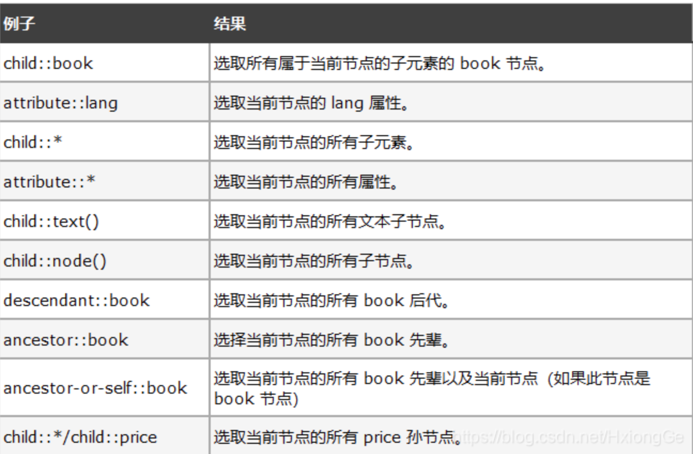
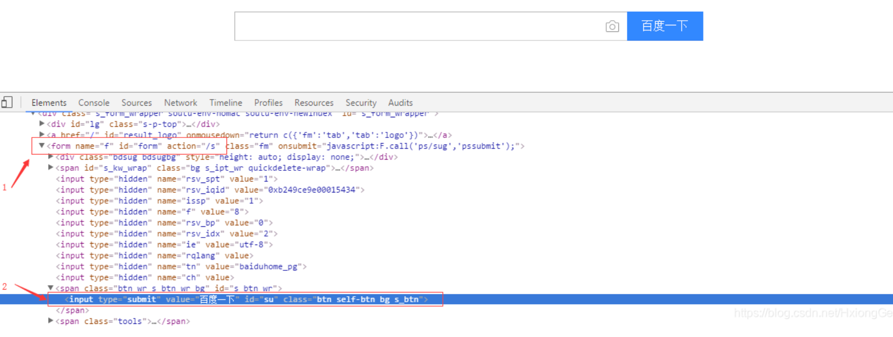
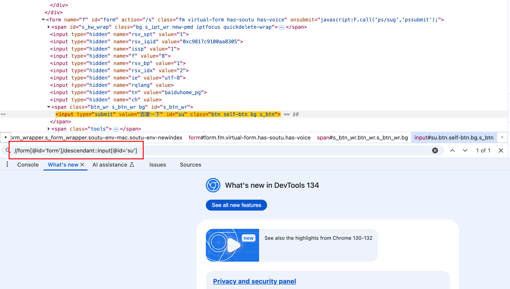
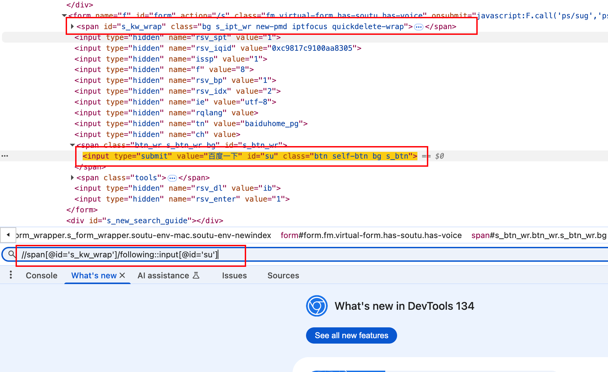
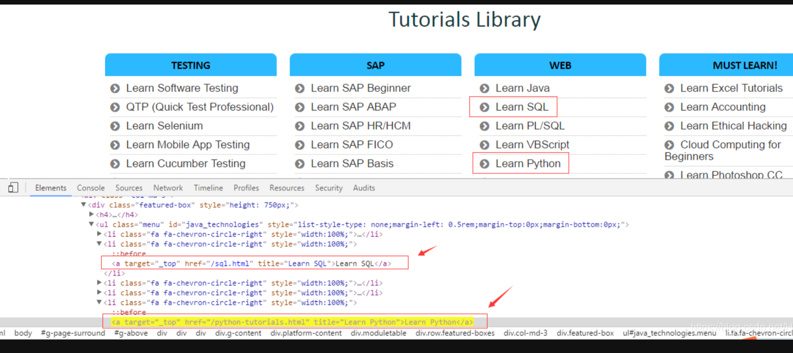

# python

## 常见函数

### strip

将字符串两头去掉指定符号, 不传默认空格

```python
str = "s hello world s"
str = str.strip('s')
print(str)
```

### list

可以将字典转换为列表

```python
dict1 = {"name": "gaozhe", "age": 21}
print(list(dict1.values()))
```


### join

将列表转换为字符串

```PYTHON
list = ['gaozhe', 'gal', 'hello']
",".join(list).strip() # 将list的每个元素两头去空格然后转换为字符串并用逗号分隔
```


### zip

`zip()` 是 Python 中一个非常有用的内置函数，用于将多个可迭代对象的元素配对打包。

```python
names = ['Alice', 'Bob', 'Charlie']
ages = [25, 30, 35]
countries = ['USA', 'UK', 'Australia']

# 使用 zip() 合并三个列表
zipped = zip(names, ages, countries)

# 转换为列表查看结果
print(list(zipped))
# 输出: [('Alice', 25, 'USA'), ('Bob', 30, 'UK'), ('Charlie', 35, 'Australia')]

```

不同长度:

```python
numbers = [1, 2, 3, 4]
letters = ['a', 'b', 'c']

# 结果只包含三个元素
print(list(zip(numbers, letters)))
# 输出: [(1, 'a'), (2, 'b'), (3, 'c')]
```


### urllib

> url编码

```python
import urllib.request 

encode_url = urllib.request.quote("https://www.runoob.com/")  # 编码
print(encode_url)

unencode_url = urllib.request.unquote(encode_url)    # 解码
print(unencode_url)
```


## requests

> 引入

```python
pip install requests
```


### get请求

语法、方法: requests.get()

传入参数:

1. url: 请求地址
2. headers: 请求头
3. timeout: 请求超时时间
4. data: 要发送到指定 url 的字典、元组列表、字节或文件对象。
5. json: 参数为要发送到指定 url 的 JSON 对象。
6. params: 接收一个字典或者字符串的查询参数，字典类型自动转换为url编码，不需要urlencode()
7. cookies: 请求携带cookies
8. verify: False表示不校验https证书
9. proxies: 代理
10. allow_redirects: 是否运行重定向

```python
import requests

params = {"name": "gaozhe", "age": "25"}
res = requests.get(url="http://www.baidu.com", params=params)
print(res.text)
```


### post请求

语法: requests.post()

传入参数:

1. data: 原始数据
2. json: json数据
3. params: 接收一个字典或者字符串的查询参数，字典类型自动转换为url编码，不需要urlencode()

```python
import requests

params = {"name": "gaozhe", "age": "25"}
res = requests.post(url="http://www.baidu.com", data=params)
print(res)
```


### respones参数

无论发送什么请求都会返回一个response对象

这个对象有以下属性:

1. response.text: 响应文本
2. response.content: 响应二进制数据或bytes数据
3. response.status_code: http响应状态码
4. response.headers: 响应的请求头
5. response.cookies: 响应的cookies
6. response.encoding: 响应网站的字符集编码
7. response.json(): 如果返回json可以直接用这个转换为字典
8. response.url: 返回响应的最终url
9. response.raise_for_status(): 如果状态码不是200会跑异常
10. response.request.headers: 返回请求header
11. response.request.body: 返回请求body
12. response.request.url: 返回请求url 


### 返回数据

response.text和response.content是我们要的返回的数据这两个写法, 所以应用场景不同

返回的字符串数据、文本数据、json数据包括密文数据.

根据Http头部对响应的编码推测的文本编码

response.encoding="ute-8"修改编码


content

返回视频、图片、音乐等二进制数据

content.decode("utf-8")解码

```python
import requests

res = requests.post(url="http://www.baidu.com")
print(res.content.decode('utf-8'))
print(res.content.decode())
print(res.text)
```


### 请求https报错

添加verify=False 让请求不再验证服务器ssl证书

response = requests.get(url, verify=False)


### Ip代理

正向代理: 请求三方服务器, 由代理服务器转发

反向代理: 三方服务引入代理服务器来响应请求

> 用法:

```python
import requests

proxies = {
    "http": "http://39.165.0.137:9002",
}
response = requests.get("http://www.httpbin.org/ip", proxies=proxies, timeout=5)
print(response)
```


### 重定向处理

allow_redirects=True

```python
import requests

headers = {
    "user-agent": "Mozilla/5.0 (Macintosh; Intel Mac OS X 10_15_7) AppleWebKit/537.36 (KHTML, like Gecko) Chrome/138.0.0.0 Safari/537.36"
}
response = requests.post("http://www.baidu.com", headers=headers, allow_redirects=True)
print(response.status_code)
```


## json

### 字典转json: dump、dumps

dump、dumps都是将字典类型转换为json, 但是dump作用于文件

参数: 

1. ensure_ascii: 默认为True。如果确保输出为ASCII，则非ASCII字符将被转义。如果为False，则非ASCII字符会以\uXXXX的形式输出。 
2. indent: 用于美化输出的缩进量（整数）。如果为None（默认值），则输出是紧凑的；如果为正值，则每个级别将缩进这么多空格。 
3. separators: 默认为(', ', ': ')，用于指定元素之间和键值对之间的分隔符。还可以得到一个压缩的json字符串
4. sort_keys: 默认为False。如果为True，则字典的输出将按键排序


```python
#!/usr/bin/python3

import json

# Python 字典类型转换为 JSON 对象
data = {
    'no': 1,
    'name': '高喆',
    'url': 'https://www.runoob.com'
}

json_str = json.dumps(data, ensure_ascii=False, indent=4, separators=(', ', '='), sort_keys=True)
print("JSON 对象：", json_str)
```


### json转字典: load、loads

```python
#!/usr/bin/python
import json

jsonData = '{"a":1,"b":2,"c":3,"d":4,"e":5}'

text = json.loads(jsonData)
print(text)
```


## pyexecs模块

安装: pip install pyexecjs

> 运行js

直接执行:

```python
import execjs


ctx = execjs.compile('''
    function add(x, y) {
        return x + y;
    }
''')


result = ctx.call('add', 1, 2)
print(result)
```

获取运行环境并执行eval:

```python
import execjs

# 获取Node.js运行时环境
ctx = execjs.get("Node")
print(ctx)

# 编写执行js
result = ctx.eval("1 + 2")
print(result)
```

获取运行环境并执行exec: 

```python
import execjs

# 获取Node.js运行时环境
ctx = execjs.get()
print(ctx)

js_code  = """
    function add(x, y) {
        return x + y;
    }
    
    return add(3, 4);
"""

result = ctx.exec_(js_code)
print(result)
```

调用外部环境: 

```python
import execjs

with open('/Users/gaozhe/PycharmProjects/PythonProject/haokan.js', 'r') as f:
    js_code = f.read()

ctx = execjs.compile(js_code)

result = ctx.call('add', 1, 2)
print(result)
```


## xpaths

### 语法规则

| 表达式   | 作用                                                     |
| -------- | -------------------------------------------------------- |
| nodename | 选取此层级节点下的**所有**子节点                         |
| /        | 代表从根节点进行选取                                     |
| //       | 可以理解为匹配，就是在所有节点中选取此节点，直到匹配为止 |
| .        | 选取当前节点                                             |
| …        | 选取当前节点上一层（上一级目录）                         |
| @        | 选取属性（也是匹配）                                     |

### 标签定位

| 方式               | 效果                                                         |
| ------------------ | ------------------------------------------------------------ |
| /html/body/div     | 表示从根节点开始寻找，标签与标签之间/表示一个层级            |
| /html//div         | 表示多个层级 作用于两个标签之间（也可以理解为在html下进行匹配寻找标签div） |
| //div              | 从任意节点开始寻找，也就是查找所有的div标签                  |
| ./div              | 表示从当前的标签开始寻找div                                  |
| //div/a \| //div/p | 选取所有div元素的a和p元素                                    |
| //span \| //ul     | 选取span和ul元素                                             |


### 属性定位

| 需求                                                    | 格式                                 |
| ------------------------------------------------------- | ------------------------------------ |
| 定位div中属性名为href，属性值为‘www.baidu.com’的div标签 | @属性名=属性值                       |
| href为属性名 'www.baidu.com’为属性值                    | /html/body/div[href=‘www.baidu.com’] |

### 索引定位

| 需求                                                         | 格式                            |
| ------------------------------------------------------------ | ------------------------------- |
| 定位ul下第二个li标签(下图)                                   | //ul/li[2]                      |
| 定位属于bookstore子元素的最后一个book元素                    | /bookstore/book[last()]         |
| 定位属于bookstore子元素的最后第二个book元素                  | /bookstore/book[last()-1]       |
| 选取属于bookstore子元素的前两个元素                          | /bookstore/book[position() < 3] |
| 获取所有拥有名为lang的属性titile元素                         | /bookstore/book[@lang]          |
| 获取所有titile元素, 且这些元素拥有eng的lang属性              | //title[@lang='eng']            |
| 获取bookstore元素的所有book元素, 且其中的price元素的值需要大于35.00 | /bookstore/book[price>35.00]    |


### 选取未知节点

XPath 通配符可用来选取未知的 XML 元素。

| 通配符 | 描述               |
| ------ | ------------------ |
| *      | 匹配任何元素节点   |
| @*     | 匹配任何属性节点   |
| node() | 匹配任何类型的节点 |




### 常见函数

| 方法          | 效果                                                         |
| ------------- | ------------------------------------------------------------ |
| /text()       | 获取标签下直系的标签内容                                     |
| contains()    | //div[contains(@class, 'teacher_info')] 表示获取class属性包含'teacher_info'的div节点 |
| starts-with() | //div[starts-with(@class, 'teacher_info')] 表示class属性以teacher_info开始的div节点 |
| not()         | //input[@name='identity' and not(contains(@class, 'a'))]，表示匹配出name为identity并且class的值中不包含a的input节点。 not()表示否定，//input[@name='identity' and not(con函数通常与返回值为true or false的函数组合起来用，比如contains(),starts-with()等，但有一种特别情况请注意一下:我们要匹配出input节点[@id]，如果我们要匹配出input节点不含用id属性的，则为://input[not(@id)]含有id属性的，写法如下://input[not(@id)] |


### 练习

#### 绝对定位

```python
xxx.find_element_by_xpath("/html/body/div[x]/form/input")
 x 代表第x个 div标签，注意，索引从1开始而不是0
```

此方法缺点显而易见，当页面元素位置发生改变时，都需要修改，因此，并不推荐使用。


> 获取图片src

```python
img_url = movies_item.xpath(".//div[@class='pic']/a/img/@src").get()
print(img_url)
```


#### 相对路径

相对路径，以‘//'开头，具体格式为

```python
xxx.find_element_by_xpath("//input[x]") 
定位第x个input标签,[x]可以省略，默认为第一个

相对路径的长度和开始位置并不受限制，也可以采取以下方法, [x]依然是可以省略的
xxx.find_element_by_xpath("//div[x]/form[x]/input[x]")
```


#### 标签属性定位

```python
xxx.find_element_by_xpath("//a[@href='/industryMall/hall/industryIndex.html']") 
xxx.find_element_by_xpath("//input[@value='确定']") 
xxx.find_element_by_xpath("//div[@class = 'submit']/input")
```


当某个属性不足以唯一区别某一个元素时，也可以采取多个条件组合的方式，具体例子

```python
xxx..find_element_by_xpath("//input[@type='name' and @name='kw1']")
```


当标签属性很少，不足以唯一区别元素时，但是标签中间中间存在唯一的文本值，也可以定位，其具体格式

```python
xxx.find_element_by_xpath("//标签[contains(text(),'文本值')]")
```


XPath 关于网页中的动态属性的定位，例如，ASP.NET应用程序中动态生成id属性值，可以有以下四种方法：

```python
- starts-with例子： //input[starts-with(@id,'ctrl')] 解析：匹配以ctrl开始的属性值

- ends-with 例子：//input[ends-with(@id,'userName')] 解析：匹配以userName结尾的属性值

- contains() 例子：//input[contains(@id,'userName')] 解析：匹配含有userName属性值
```


#### 步

> 实践

1. **descendant**表示取当前节点的所有后代元素

定位百度首页的“百度一下”按钮



可以看到， 标签的父元素是标签，而标签的父元素是标签，所以可以通过先定位标签，然后利用descendant定位标签

xpath路径如下：

```python
xpath= "//form[@id='form']/descendant::input[@id='su']"

//form[@id='form']表示找到id属性为'form'的<form>标签，
descendant::input表示找到<form>标签的所有后代<input>标签，
然后通过[@id='su']精准定位到id属性为'su'的<input>标签
```


把路径放到浏览器控制台，按下Ctrl+F，然后输入xpath路径，查看一下，确实定位到了标签（在执行程序之前，可以通过这种方式来验证一下写的xpath路径是否正确）



2. **following**表示选取当前节点结束标签之后的所有节点

注意这里说的是“结束标签之后”，所以在用这个轴进行定位时要看清目标标签的与辅助定位标签的层级关系,所以上例中就不能通过标签结合following来定位，因为标签在标签里面；
分析一下：标签的上级是一个标签，这个标签上面也有一个标签，可以通过它来定位

```python
xpath= "//span[@id='s_kw_wrap']/following::input[@id='su']"

//span[@id='s_kw_wrap']表示定位到id属性为s_kw_wrap的<span>标签，
/following::input[@id='su']表示找到<span>结束标签(即</span>)后的所有input标签，
然后通过[@id='su']精准定位到id属性为'su'的<input>标签
```



3. **parent**可指定要查找的当前节点的直接父节点

例如，父节点是个div，即可写成parent::div，如果要找的元素不是直接父元素，则不可使用parent，可使用ancestor，代表父辈、祖父辈等节点，child::表示直接子节点元素，following-sibling只会标识出当前节点结束标签之后的兄弟节点，而不包含其他子节点;

以https://www.guru99.com/这个网站为例:



定位Learn Python，思路如下：先定位Learn SQL，然后找到Learn SQL的父节点li，然后再找li的兄弟节点，即包含Learn Python的那个li标签，然后再找li的孩子节点，也就是a标签

```python
//a[text()='Learn SQL']/parent::li/following-sibling::li/child::a[text()='Learn Python']

也可以这样写

//a[text()='Learn SQL']/parent::li/following-sibling::li[3]/a
```

父节点的另2种方式：

```python
# 1.巧妙使用..反向寻找
//span[@class='title-content-title']/..

# 2.巧妙使用[]属性
//a[./span[@class='title-content-title']]
//ul[//span[@class='title-content-title']]
```


## 数据存储

### csv

#### 写入数据

>  writerow: 

```python
import csv

with open('./test1.csv', 'w', newline='') as csvfile:
   csvwriter = csv.writer(csvfile)
   csvwriter.writerow(['name', 'age', 'sex'])
   csvwriter.writerow(['gaozhe', '26', 'man'])
```

> writerows

```python
import csv

with open('./test1.csv', 'w', newline='') as csvfile:
   csvwriter = csv.writer(csvfile)
   csvwriter.writerow(['name', 'age', 'sex'])
   csvwriter.writerows([['gaozhe', '26', 'man'], ['xiaozhang', '21', 'girl']])
```

> 写入字典数据

```python
import csv

data = [
   {"name": "gaozhe", "age": 25, "sex": "man"},
   {"name": "xiaozhang", "age": 21, "sex": "girl"},
   {"name": "xiaowang", "age": 22, "sex": "man"}
]

with open('./test1.csv', 'w', newline='') as csvfile:
   csvwriter = csv.DictWriter(csvfile, fieldnames=data[0].keys())
   csvwriter.writeheader()
   for datum in data:
      csvwriter.writerow(datum)
```


```python
import csv

data = [
   {"name": "gao2zhe", "age": 25, "sex": "man"},
   {"name": "xiaozhang", "age": 21, "sex": "girl"},
   {"name": "xiaowang", "age": 22, "sex": "man"}
]

with open('./test1.csv', 'w', newline='') as csvfile:
   csvwriter = csv.writer(csvfile)
   csvwriter.writerow(data[0].keys())  #写入表头
   for datum in data:
      csvwriter.writerow(datum.values())
```


#### 读取数据

```python
import csv

with open('./test1.csv', 'r', newline='') as csvfile:
   res = csv.reader(csvfile)
   for re in res:
      print(re)

```


> 读取字典数据

```python
import csv

with open('./test1.csv', 'r', newline='') as csvfile:
   res = csv.DictReader(csvfile)
   for re in res:
      print(re)

```


